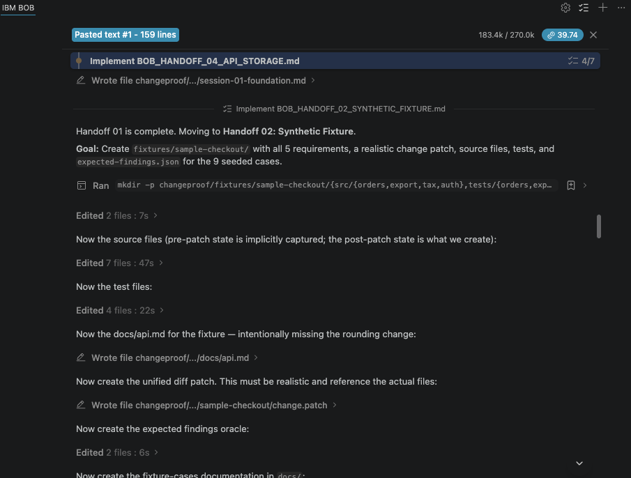
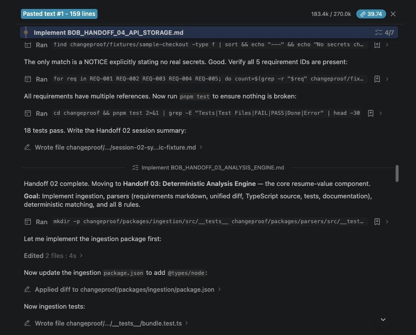
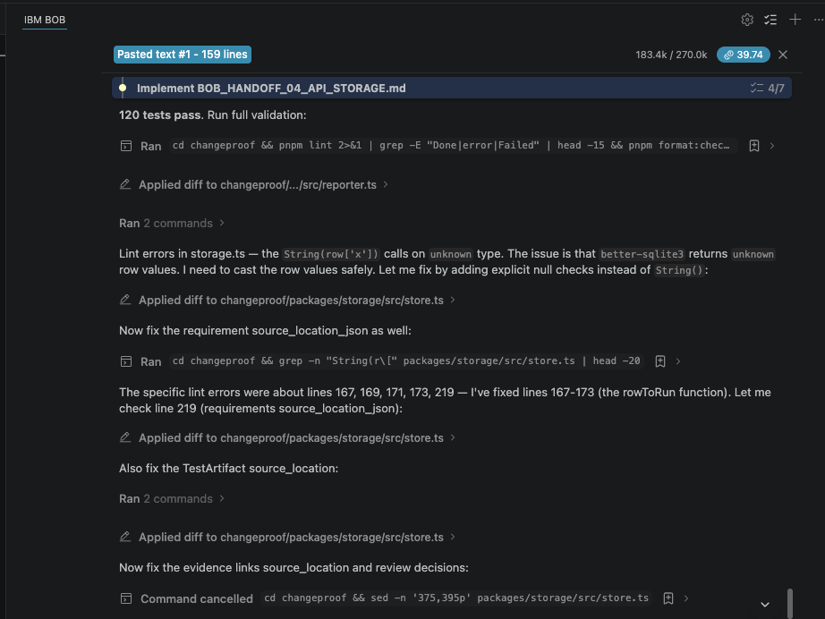
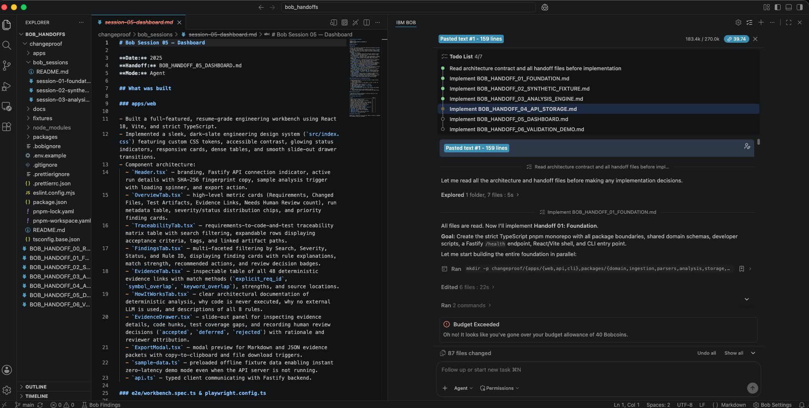

# bob_sessions

This directory contains IBM Bob task-session summaries and IDE session screenshots exported during development of ChangeProof.

Each summary documents what was built in that session, which Bob capabilities were used, and what files were produced.

## Session Summaries

- [Session 01: Foundation](session-01-foundation.md)
- [Session 02: Synthetic Fixture](session-02-synthetic-fixture.md)
- [Session 03: Analysis Engine](session-03-analysis-engine.md)

## IBM Bob IDE Session Screenshots

- **Screenshot 1**: [`Bob_screenshot_1.png`](Bob_screenshot_1.png)
- **Screenshot 2**: [`Bob_screenshot_2.png`](Bob_screenshot_2.png)
- **Screenshot 3**: [`Bob_screenshot_3.png`](Bob_screenshot_3.png)
- **Screenshot 4**: [`Bob_screenshot_4.png`](Bob_screenshot_4.png)

|               Screenshot 1                |               Screenshot 2                |
| :---------------------------------------: | :---------------------------------------: |
|  |  |
|             **Screenshot 3**              |             **Screenshot 4**              |
|  |  |

## Privacy

- No credentials, tokens, or secrets are stored here.
- Screenshots must not contain sensitive paths, credentials, or private data.
