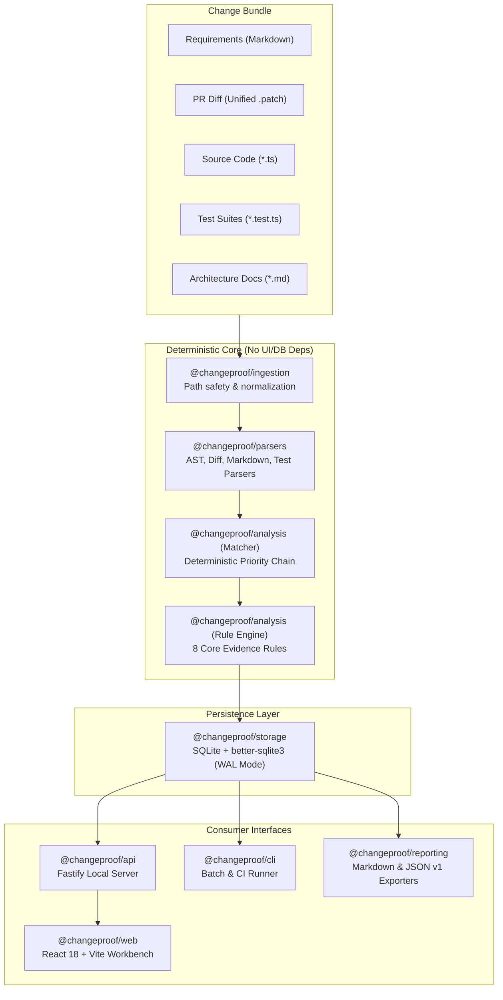

# ChangeProof — Architecture & System Design

ChangeProof is an evidence-first change-readiness workbench engineered with strict layer separation and deterministic execution guarantees.

---

## 1. System Architecture Overview

---

## 2. Package Boundaries & Responsibilities

| Package                  | Responsibility                                                                                      | Dependencies                                 |
| ------------------------ | --------------------------------------------------------------------------------------------------- | -------------------------------------------- |
| `@changeproof/domain`    | Shared Zod schemas, TypeScript types, and status enumerations.                                      | None                                         |
| `@changeproof/ingestion` | File filtering, path traversal protection, size validation, SHA-256 fingerprinting.                 | `domain`                                     |
| `@changeproof/parsers`   | Unified diff parsing, TypeScript AST symbol extraction, requirements parsing, test case extraction. | `domain`                                     |
| `@changeproof/analysis`  | Matcher priority hierarchy, 8 pure deterministic rule evaluators, orchestrator `analyzeBundle`.     | `domain`, `ingestion`, `parsers`             |
| `@changeproof/storage`   | Typed SQLite repositories (`better-sqlite3`), repeatable schema initialization, WAL mode.           | `domain`                                     |
| `@changeproof/reporting` | Markdown audit report generator, machine-readable JSON schema v1.0.0 serializer.                    | `domain`                                     |
| `@changeproof/api`       | Fastify HTTP server, Zod request/response validation, synchronous analysis runner.                  | `domain`, `analysis`, `storage`, `reporting` |
| `@changeproof/cli`       | Command-line interface for headless CI analysis, artifact persistence, and report export.           | `domain`, `analysis`, `storage`, `reporting` |
| `@changeproof/web`       | React 18 / Vite workbench with traceability matrix, findings filter, and evidence drawer.           | `domain`                                     |

---

## 3. Strict Architectural Isolation

A critical design requirement is that the **analysis engine (`@changeproof/analysis`) has zero dependencies on React, Fastify, or SQLite**.

- The core analysis engine is completely pure and operates on in-memory normalized data structures.
- The storage layer (`@changeproof/storage`) acts as an optional persistence adapter.
- The API and CLI layers are thin orchestrators that invoke the same engine and repository abstractions.
- The web frontend communicates with the API over HTTP and provides a built-in offline fixture mode for standalone previewing.

---

## 4. Deterministic Run Fingerprint

Every analysis run computes a stable SHA-256 fingerprint derived from normalized bundle contents:

$$\text{Fingerprint} = \text{SHA256}\left(\sum \text{normalized\_path} \parallel \text{sha256(content)}\right)$$

- File order is sorted lexicographically by normalized path.
- Line endings (`\r\n` vs `\n`) are normalized to LF before hashing.
- Running analysis multiple times against identical inputs produces the exact same fingerprint and finding IDs.

---

## 5. Security Architecture

1. **No Remote APIs:** Operates 100% locally. No API keys, cloud tokens, or external network requests.
2. **Zero Code Execution:** Application and test source files are parsed statically as ASTs and text. Neither `eval()`, `vm`, `child_process`, nor runtime test runners are invoked on fixture code.
3. **Path Traversal Immunity:** All file paths are strictly validated to prevent `../` directory escapes and block sensitive file names (`.env`, `id_rsa`, `.git`).
4. **Bounded Input Constraints:** Configurable caps on file count (max 200 files) and total bundle size (max 10MB) prevent denial-of-service via malformed diffs.
